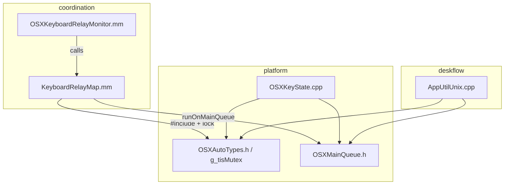

# Architecture Review — macOS TIS Main-Queue Hotfix

**Remediation (2026-07-01):** Critical layer-boundary violation resolved — `KeyboardRelayMap.mm` now uses `platform/OSXKeyLayout.h` only; TIS fetch + `g_tisMutex` encapsulated in `platform_osx_keys` static library linked from coordination without importing platform internals.

**Scope:** `src/lib/platform/OSXKeyState.cpp`, `src/lib/platform/OSXAutoTypes.h`, `src/lib/coordination/KeyboardRelayMap.mm`, `src/lib/coordination/CMakeLists.txt`  
**Diff range:** `7f18e1d20..HEAD` (commits `d4dec8aa9`, `facee934a`)  
**Date:** 2026-07-01  
**Reviewer:** architecture-review-agent

---

## Architecture Review

### Executive Summary

The hotfix correctly addresses macOS 14+ main-queue assertions for Text Input Source (TIS) APIs by routing layout fetches through `deskflow::platform::osx::runOnMainQueue`, retaining `CFData` across thread boundaries, and adding `AutoCFData` RAII. The relay path also correctly moves the KeyUp early return before the TIS hop.

However, **`KeyboardRelayMap.mm` now imports platform headers and acquires `g_tisMutex` directly**, reversing the dependency contract documented in the prior keyboard-handoff architecture review (“coordination must not gain platform deps”). The fix works at runtime, but layer boundaries and CMake dependency expression are weakened.

**Verdict:** Fix 1 layer-boundary violation before merge (encapsulate TIS fetch in platform); otherwise architecturally acceptable as a pragmatic hotfix.

---

### Layer Map (Relevant to This Change)

**Expected dependency direction (project convention):** coordination → common/base only for portable logic; OS-specific adapters in coordination may call frameworks directly but should **not** import platform implementation headers. Platform utilities (`OSXMainQueue`) may be consumed by deskflow and platform; coordination should prefer encapsulation over reaching into `g_tisMutex`.

---

### Layer Separation

**Violations found:** 2

- `src/lib/coordination/KeyboardRelayMap.mm:10` — coordination imports `platform/OSXAutoTypes.h` solely to access `g_tisMutex` (platform implementation detail).
- `src/lib/coordination/KeyboardRelayMap.mm:11` — coordination imports `platform/OSXMainQueue.h`; acceptable utility reuse in isolation, but combined with the mutex import it embeds platform TIS protocol inside coordination.

**Clean files:**

- `src/lib/platform/OSXAutoTypes.h` — adds `AutoCFData`; `g_tisMutex` remains platform-owned (no upward imports).
- `src/lib/platform/OSXKeyState.cpp` — TIS fetch correctly stays in platform layer; uses `runOnMainQueue` + `g_tisMutex` + `AutoCFData` consistently.
- `src/lib/coordination/CMakeLists.txt` — framework link change only; no improper source moves.

**Prior contract regression:** The keyboard-handoff architecture review (`docs/code-review/architecture-review.md`, prior revision) recorded `coordination | platform | None added — OK`. This diff **adds** coordination→platform header coupling.

---

### State Management Assessment

Not applicable — no state-management units in scope. Relay key mapping is a stateless pure function (`mapRelayKeyFromCgEvent`).

---

### Dependency Direction

**Direction violations:** 1 (compile-time / architectural)

| From | To | Mechanism | Status |
| --- | --- | --- | --- |
| `KeyboardRelayMap.mm` | `platform/OSXAutoTypes.h`, `platform/OSXMainQueue.h` | `#include` via `common`’s `$CMAKE_SOURCE_DIR/src/lib` include path | **Violation** — not declared in CMake |
| `OSXKeyState.cpp` | `platform/OSXMainQueue.h`, `OSXAutoTypes.h` | same-layer includes | OK |
| `platform` | `coordination` | none | OK — no cycle |

**CMake gap:** `coordination` links `common` and `base` only (`target_link_libraries(coordination PUBLIC common base)`). It does **not** link `platform`, yet `KeyboardRelayMap.mm` now depends on platform headers. Compilation succeeds because `common` exposes the entire `src/lib` tree as a public include directory — an implicit, undeclared dependency that the build graph does not enforce.

**Clean dependencies:**

- No circular package dependencies introduced.
- Carbon framework addition in coordination CMakeLists is consistent with existing direct Carbon usage (`LMGetKbdType`, `UCKeyTranslate`) in `KeyboardRelayMap.mm`.

---

### Change Analysis by File

#### `platform/OSXAutoTypes.h`

Adds `AutoCFData` RAII alias alongside existing CoreFoundation/TIS smart pointers. Correct platform-layer consolidation; enables safe cross-thread layout data lifetime in both `OSXKeyState` and relay mapping.

`inline std::mutex g_tisMutex` remains a **global coordination primitive** shared across platform, deskflow (`AppUtilUnix.cpp`), and now coordination. Expanding the set of mutex holders increases coupling surface area.

#### `platform/OSXKeyState.cpp`

Refactors `mapKeyFromEvent` TIS layout fetch to:

1. `runOnMainQueue` lambda with `g_tisMutex` lock
2. `TISCopyCurrentKeyboardLayoutInputSource` + property fetch
3. `CFRetain` before returning across threads
4. `AutoCFData` ownership on the calling thread

Aligns with existing patterns in `getKeyMap`, `getGroups`, and `pollActiveGroup`. Business logic (UCKeyTranslate, dead keys, modifier handling) remains on the CGEventTap thread after layout bytes are copied — correct separation of “main-queue TIS fetch” vs “layout translation.”

#### `coordination/KeyboardRelayMap.mm`

Mirrors the platform TIS fetch pattern inline for relay key translation. Improvements:

- KeyUp path returns before TIS hop (avoids unnecessary `dispatch_sync` on release events).
- `CFRetain` / `AutoCFData` prevents use-after-free of layout bytes on relay CFRunLoop thread.

Concerns:

- **Duplicated TIS block** (~12 lines) vs `OSXKeyState.cpp:300–313` — only differs in TIS source API (see below).
- **Layer leak:** coordination directly locks `g_tisMutex` instead of calling a platform encapsulation.
- **`LMGetKbdType()`** still invoked on relay thread (line 124) outside `runOnMainQueue`. Pre-existing; Carbon API unlike TIS may not require main queue — acceptable but inconsistent with comment scope.

**TIS source API divergence (pre-existing, now side-by-side):**

| Call site | TIS API |
| --- | --- |
| `OSXKeyState.cpp:302` | `TISCopyCurrentKeyboardLayoutInputSource` |
| `KeyboardRelayMap.mm:127` | `TISCopyCurrentKeyboardInputSource` |

Hotfix did not unify these. Architectural risk: relay and local key mapping may disagree under IME/composed-input layouts if the distinction is unintentional.

#### `coordination/CMakeLists.txt`

Adds `-framework Carbon` alongside existing ApplicationServices link for Apple builds. Required for `LMGetKbdType` / `UCKeyTranslate` already used in `KeyboardRelayMap.mm`. No structural package changes.

---

### Coupling Assessment

| Coupling | Severity | Notes |
| --- | --- | --- |
| coordination → `g_tisMutex` | High | Global mutex protocol now spans three layers; any TIS caller must know lock ordering |
| Duplicated TIS fetch lambdas | Medium | Two production copies; third caller likely to copy-paste again |
| Header-only platform deps in coordination | Medium | CMake graph hides real dependency |
| Shared `runOnMainQueue` utility | Low (positive) | Correct DRY for dispatch_sync pattern; documented deadlock rationale |
| `AutoCFData` in shared header | Low (positive) | RAII at platform layer, reused downstream |

**Threading model (unchanged, still valid):** Relay tap runs on dedicated CFRunLoop thread (`OSXKeyboardRelayMonitor`); `runOnMainQueue` blocks that thread on `dispatch_sync` to GUI main queue. Same pattern as `OSXKeyState` on CGEventTap thread and `AppUtilUnix` from QThread worker. Documented in `OSXMainQueue.h`.

---

### Package Structure

**coordination:** Complete for this change scope.

- Apple-specific sources remain in coordination (pre-existing pattern for `OSXKeyboardRelayMonitor`, `KeyboardRelayMap`).
- Missing: explicit dependency declaration if platform headers are required (`target_link_libraries` or a thin platform-headers interface target).

**platform:**

- `OSXMainQueue.h` is header-only and **not listed** in `platform/CMakeLists.txt` `PLATFORM_SOURCES` (same as before this diff). Discoverability relies on include path convention.
- `OSXAutoTypes.h` is listed in platform sources.

---

### Findings Summary

#### Critical — 1

1. **Coordination imports platform implementation detail (`g_tisMutex`)** — `KeyboardRelayMap.mm:10,126` couples coordination to platform mutex protocol; contradicts prior “no coordination→platform deps” contract. Encapsulate TIS layout fetch in a platform helper so coordination only calls a platform API (or only includes `OSXMainQueue.h` / dedicated layout header).

#### Important — 3

1. **Undeclared CMake dependency** — coordination uses platform headers without linking `platform` or an interface target; build graph does not reflect real coupling.

2. **Duplicated TIS layout-fetch logic** — identical threading/retain/RAII pattern in `OSXKeyState.cpp` and `KeyboardRelayMap.mm`; maintenance and lock-protocol drift risk.

3. **Undocumented TIS source API split** — `TISCopyCurrentKeyboardLayoutInputSource` vs `TISCopyCurrentKeyboardInputSource` with no comment; behavioral divergence risk for relay vs local mapping.

#### Suggestions — 3

1. **Extract platform helper**, e.g. `copyRetainedUnicodeKeyLayoutOnMainQueue(bool layoutInputSource)` in `OSXMainQueue.h` or `OSXKeyboardLayout.h`, moving mutex + TIS calls out of coordination.

2. **Document or unify TIS source choice** at the helper or call site after manual IME/layout testing.

3. **Add `OSXMainQueue.h` to platform CMakeLists** (or a `platform/osx` interface library) so header ownership is explicit in the build system.

---

### Positive Patterns (Keep)

- `runOnMainQueue` reuse instead of a third copy of dispatch boilerplate.
- `CFRetain` before returning layout data across threads; `AutoCFData` for ownership on consumer thread.
- KeyUp early return before TIS fetch in relay path (performance + clarity).
- Platform-layer fix in `OSXKeyState` keeps key-state translation logic in platform where it belongs.

---

### Conclusion

The hotfix solves the macOS 14+ TIS threading constraint correctly at runtime and follows established `runOnMainQueue` patterns. The **architectural debt** is coordination reaching into `g_tisMutex` and duplicating platform TIS fetch logic. Encapsulating layout lookup in a single platform helper restores layer boundaries without changing behavior. Until then: **needs work on 1 critical layer violation**; no circular dependencies or relay-policy regressions.
