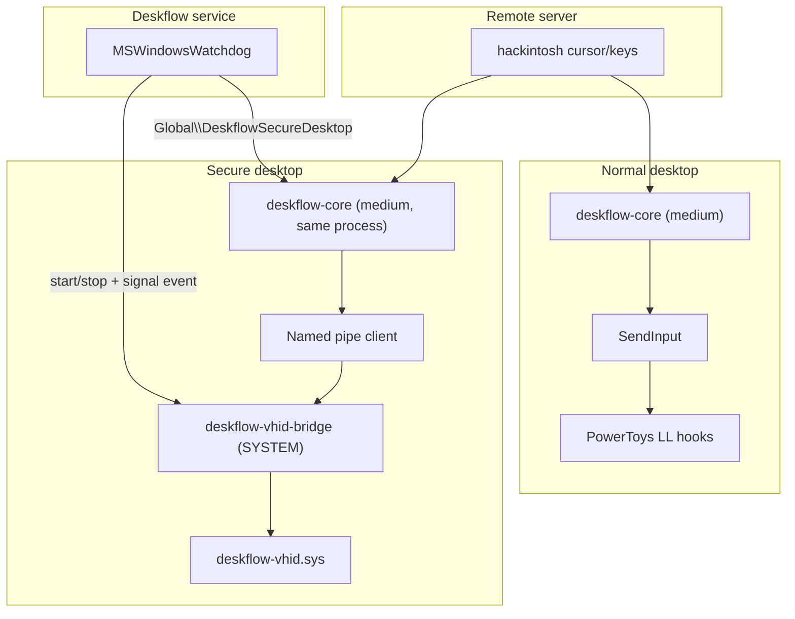

# feat: Windows VHID Phase 2 — core forwards KVM to bridge pipe

**Status:** Ready to build  
**Brainstorm:** [2026-06-30-windows-vhid-dual-input-path-brainstorm-doc.md](../brainstorm/2026-06-30-windows-vhid-dual-input-path-brainstorm-doc.md)  
**Supersedes (partially):** auto-elevate core relaunch for secure-desktop input when `vhidBridgeEnabled=true`

## Summary

Wire `deskflow-core` to forward mouse/keyboard to `deskflow-vhid-bridge.exe` (named pipe)
while the secure/login desktop is active, so remote KVM works at login/UAC **without**
elevating core. Normal desktop continues using `SendInput` so PowerToys/Mouser hooks work.

**Target fleet config:**

```ini
[daemon]
elevate=false
vhidBridgeEnabled=true
```

## Problem

| Component | Today | Gap |
|-----------|-------|-----|
| Watchdog | Starts bridge in `pipe` mode on `LogonUI.exe` / `consent.exe` | Done (Phase 3) |
| Bridge | Listens on `\\.\pipe\deskflow-vhid-bridge`, accepts `move`/`click`/`key` | Done (Phase 1) |
| Core | Always `SendInput` — blocked on secure desktop | **Not built** |
| Auto-elevate | Relaunches core SYSTEM — **crashes** on tiny11 | Deprecated path |

## Architecture



### Secure-desktop signal (decided in brainstorm)

Mirror existing `kSendSasEventName` pattern:

1. Watchdog creates/signaled `Global\\DeskflowSecureDesktop` when bridge transitions
   start/stop (after debounce).
2. Core opens the event and tracks `secureDesktopActive` locally.
3. Core reads `daemon/vhidBridgeEnabled` from settings at startup / on config reload.

## Scope

### In scope

- Named event constant in `Constants.h.in`
- Watchdog signals event on bridge lifecycle (`MSWindowsWatchdog.cpp`)
- Pipe client helper (`MSWindowsVhidPipeClient.{h,cpp}`)
- Route mouse relative move, buttons, wheel, keys through pipe when secure + vhid enabled
- Skip `SendInput` on secure desktop when routing to pipe
- Relative motion only on secure desktop (convert absolute server moves to deltas)
- Logging when pipe connect fails or bridge unavailable
- Unit tests for command formatting and delta conversion
- Update `docs/dev/WINDOWS_DEBUG.md` and existing UAC plan Phase 2 status

### Out of scope (v1)

- PowerToys/Mouser on secure desktop
- Auto-fallback to `elevate=true` when bridge fails (log + manual toggle only)
- Absolute cursor on login screen
- TLS mesh client inside bridge (macOS model)
- Fixing elevated-core crash (separate issue; fallback only)

## Implementation plan

### Task 1 — Secure-desktop event (`Constants.h.in`, `MSWindowsWatchdog.cpp`)

- [ ] Add `kSecureDesktopEventName = L"Global\\DeskflowSecureDesktop"` next to
      `kSendSasEventName` in `src/lib/common/Constants.h.in`
- [ ] In `startVhidBridge()`: `SetEvent` after successful bridge start
- [ ] In `stopVhidBridge()`: `ResetEvent` (create event in watchdog ctor or first use,
      manual-reset, initial nonsignaled)
- [ ] Log transitions at INFO

### Task 2 — Pipe client (`MSWindowsVhidPipeClient.{h,cpp}`)

New platform helper:

```cpp
// Pseudocode — actual API match project style
class MSWindowsVhidPipeClient {
  bool connect();           // CreateFileW on \\.\pipe\deskflow-vhid-bridge
  void disconnect();
  bool isConnected() const;
  bool sendMove(int8_t dx, int8_t dy);
  bool sendClickLeft();
  bool sendClickRight();
  bool sendKeyUsage(uint8_t usage, bool down);
};
```

- [ ] Persistent connection while secure desktop active; reconnect on `ERROR_PIPE_BUSY`
- [ ] Write line-oriented commands matching `deskflow-vhid-bridge-win.cpp` (`move`, `click`, `key`)
- [ ] Clamp dx/dy to `int8_t` range (bridge already casts)
- [ ] Add to `src/lib/platform/CMakeLists.txt`

### Task 3 — Secure routing in `MSWindowsDesks.cpp`

Injection entry points (existing):

- `deskMouseMove` / `deskMouseRelativeMove`
- Mouse button/wheel handlers in `deskThread` message loop (~lines 714–732)
- Keyboard path via desk window / key state (trace from `MSWindowsKeyState` fake key down)

- [ ] Add `MSWindowsDesks` member or static context: pipe client + secure flag
- [ ] On secure + vhid enabled:
  - `deskMouseRelativeMove` → `sendMove(dx, dy)` on pipe
  - `deskMouseMove` → compute delta from last position (store last x/y), send relative
  - Buttons → `sendClickLeft` / right variant
  - Wheel → extend bridge protocol if needed, or skip v1 (document limitation)
- [ ] When routing to pipe, **return early** without `SendInput`
- [ ] When not secure, existing `SendInput` path unchanged

### Task 4 — Keyboard HID usage mapping

Bridge expects USB HID usage IDs (`key 40 down` = usage 0x28).

- [ ] Add minimal VK → HID usage map for alphanumerics, Enter, Tab, Backspace, arrows
      (reuse tables from driver headers or macOS bridge if present)
- [ ] Wire `MSWindowsKeyState::fakeKeyDown` / key up to pipe when secure routing active
- [ ] Document unmapped keys in debug log (v1: English login layout sufficient)

### Task 5 — Core settings + event polling

- [ ] Read `Settings::Daemon::VhidBridgeEnabled` in `MSWindowsScreen` or `MSWindowsDesks` init
- [ ] Poll or wait on `kSecureDesktopEventName` from desk thread (or 100ms timer like
      watchdog debounce) to flip `m_secureDesktopRouting`
- [ ] On secure enter: `pipe.connect()`; on secure leave: `pipe.disconnect()`

### Task 6 — Bridge hardening (small)

- [ ] `deskflow-vhid-bridge-win.cpp`: keep pipe server alive across disconnects (already loops)
- [ ] Optional: bridge logs to `%ProgramData%\Deskflow\vhid-bridge.log` (Phase 4 polish —
      defer unless trivial)

### Task 7 — Tests

- [ ] `MSWindowsVhidPipeClientTests.cpp`: command string formatting (`move 10 -3`, `key 40 down`)
- [ ] Delta conversion helper tests (absolute → relative clamping)
- [ ] No kernel/driver tests in CI (manual on tiny11)

### Task 8 — Documentation

- [ ] Update `docs/plan/2026-06-30-windows-vhid-uac-injection.md` Phase 2 → in progress/done
- [ ] `docs/dev/WINDOWS_DEBUG.md`: remove “Phase 1 only” caveat after merge
- [ ] `docs/user/configuration.md`: document interaction of both daemon flags

## Acceptance criteria

1. With driver installed and Phase 2 build:
   - `elevate=false`, `vhidBridgeEnabled=true`
   - Remote KVM works on **normal desktop**; PowerToys remaps deskflow keys
2. Lock screen: remote pointer moves (relative), can click password field; **single**
   `deskflow-core` PID throughout
3. UAC: remote Yes/No click works via VHID
4. Opening/closing UAC does **not** restart `deskflow-core`
5. Daemon log shows bridge start/stop; core log shows pipe connect/disconnect
6. With driver missing: clear error log; no crash loop

## Validation checklist (tiny11)

```powershell
# 1. Driver present
pnputil /enum-devices /class System | Select-String Deskflow

# 2. Config
# Deskflow.conf: elevate=false, vhidBridgeEnabled=true

# 3. Stop → Start Deskflow from GUI

# 4. Normal desktop: move cursor, test PowerToys remap

# 5. Win+L → login screen: remote move + click + type password

# 6. Trigger UAC (e.g. runas): remote click Yes

# 7. Confirm core PID stable:
Get-Process deskflow-core | Select-Object Id,StartTime
```

## Risks and mitigations

| Risk | Mitigation |
|------|------------|
| VHF does not reach `consent.exe` on tiny11 | Run Phase 1 `demo-uac` before Phase 2 merge; gate fleet rollout |
| Pipe race: core connects before bridge ready | Retry connect with backoff; watchdog starts bridge before signaling event |
| Absolute mouse from server on login | Convert to relative deltas in `deskMouseMove` |
| Elevated-core crash still blocks users on old config | Document `elevate=false` interim; fix crash separately |
| Keyboard layout mismatch at login | v1: US HID usages; log unmapped VK |

## File touch list (estimated ≤8 production files)

| File | Change |
|------|--------|
| `src/lib/common/Constants.h.in` | Event name |
| `src/lib/platform/MSWindowsWatchdog.cpp` | Signal event |
| `src/lib/platform/MSWindowsVhidPipeClient.{h,cpp}` | **New** pipe client |
| `src/lib/platform/MSWindowsDesks.{h,cpp}` | Secure routing |
| `src/lib/platform/MSWindowsKeyState.cpp` | Key routing when secure |
| `src/lib/platform/CMakeLists.txt` | New source |
| `src/unittests/platform/MSWindowsVhidPipeClientTests.cpp` | **New** tests |
| `docs/dev/WINDOWS_DEBUG.md` | Update |

## Dependencies

- Phase 1: `deskflow-vhid.sys` installed on test machine
- Phase 3: `daemon/vhidBridgeEnabled` + watchdog bridge lifecycle (done)
- User action: set `elevate=false` before testing Phase 2

## Estimated effort

| Task | Size |
|------|------|
| Event + watchdog | S |
| Pipe client | M |
| Mouse routing | M |
| Keyboard routing | M |
| Tests + docs | S |
| **Total** | ~2–3 focused sessions |
