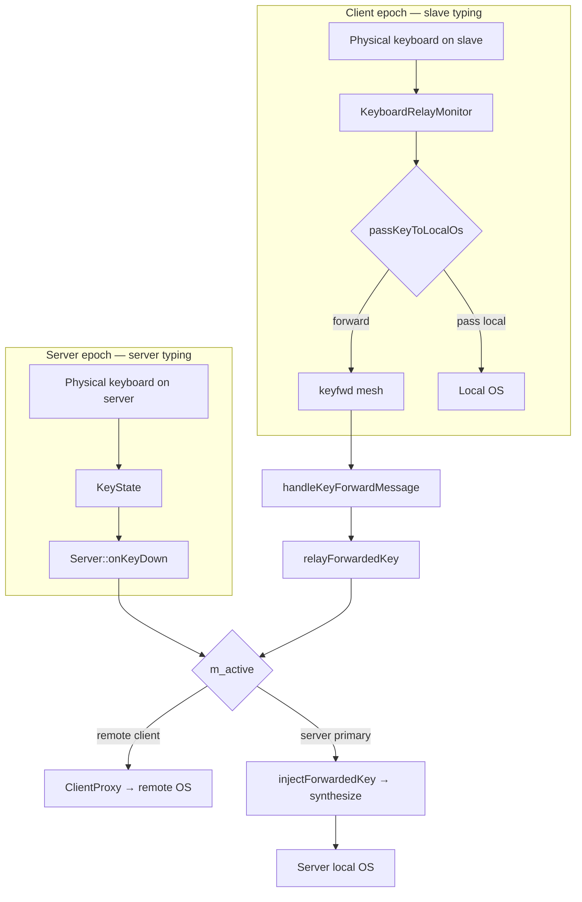

---
vgv_next:
  skill: build
  artifact: docs/plan/2026-06-30-fix-fleet-keyboard-handoff-still-failing-plan.md
title: fix fleet keyboard handoff still failing
type: fix
date: 2026-06-30
---

## fix fleet keyboard handoff still failing — Standard

## Overview

User expectation: **any keyboard on any fleet machine should type on whichever machine currently holds the cursor** — bidirectional, not only after moving the mouse to the host.

Relay gating fixes are on `origin/master` (`28d67f08f`, `54f47bdb8`). Field behavior can still fail because keyboard handoff uses **two different code paths**, and a **critical server-primary inject fix is still local-only** (not pushed).

Brainstorm (prior relay gate work): [`docs/brainstorm/2026-06-30-fix-fleet-keyboard-follow-cursor-relay-brainstorm-doc.md`](../brainstorm/2026-06-30-fix-fleet-keyboard-follow-cursor-relay-brainstorm-doc.md)

Prior plan (implemented relay gate): [`docs/plan/2026-06-30-fix-fleet-keyboard-follow-cursor-relay-plan.md`](2026-06-30-fix-fleet-keyboard-follow-cursor-relay-plan.md)

## Problem Statement / Motivation

| Observed | Expected |
|----------|----------|
| Typing on a slave does nothing on the cursor host (especially when cursor is on the **server’s local screen**) | Slave keystrokes appear on the cursor host |
| “It only works if I move the mouse there first” | Keyboard follows cursor without requiring a fresh mouse enter |
| Mouse/KVM works; keyboard does not | Keyboard parity with cursor routing |

### Why it can still fail (ranked)

| Rank | Cause | Who is affected |
|------|-------|-----------------|
| **1** | **`PrimaryClient` swallows relayed keys** — `relayForwardedKey` → `onKeyDown` → `PrimaryClient::keyDown` is intentionally no-op; slave `keyfwd` never synthesizes on server primary | Slave → server **local screen** |
| **2** | **Fix not deployed** — `injectForwardedKey` exists only in local working tree; fleet machines on `28d67f08f` without `PrimaryClient` / `Server.cpp` changes | Same as #1 |
| **3** | **Screen sync not established** — relay uses `cursorScreenKnown` from `Client::enter()` / `leave()` only; no enter/leave → wrong gate after 300 ms grace | “Works after mouse move” |
| **4** | **Boot grace (300 ms)** — unknown screen → keys pass locally; user types before `CoordinationScreenEntered` | Brief false-local at epoch start |
| **5** | **macOS Input Monitoring denied** — `CGEventTapCreate` fails; relay never intercepts | All slave forwarding on that Mac |
| **6** | **Wrong deskflow server epoch** — `keyfwd` only handled when `role == Server`; sent to wrong mesh address | Intermittent / after promotion flip |
| **7** | **Server keyboard → remote** — separate KeyState path (`Server::onKeyDown` → `m_active`); not the client relay | Server typing while cursor on remote slave |
| **8** | **Peer name mismatch** — `dropping keyfwd from unknown peer` | Specific machines only |
| **9** | **`keyboardFollowCursor=false`** | Relay disabled by config |

## Proposed Solution

Two phases: **confirm which path is broken** (diagnostic soak), then **ship remaining code + validate bidirectional matrix**.

### Architecture (two paths — both required for “any keyboard → cursor host”)



| Scenario | Active path | Must work |
|----------|-------------|-----------|
| Slave types, cursor on **remote** screen | Client relay → `keyfwd` → `m_active` = remote | P0 |
| Slave types, cursor on **server local** screen | Client relay → `keyfwd` → `injectForwardedKey` | P0 (**uncommitted**) |
| Server types, cursor on **remote** screen | KeyState → `onKeyDown` → remote client | P0 |
| Typing on machine that **has** cursor | Relay pass-through or direct OS | P0 |

## Phase 1 — Diagnostic soak (no new code)

Run on hackintosh + macbook (+ tiny11 if available). Enable file logging (`log/toFile=true`) on each machine.

### 1.1 Verify build identity

On each machine:

```bash
git log -1 --oneline
# Expect at least: 28d67f08f fix(coordination): stabilize fleet keyboard handoff relay gating
# For slave→server-primary: need injectForwardedKey commit (not on origin yet)
```

### 1.2 Log signature triage

When typing on slave with cursor elsewhere:

| Log on slave | Log on server | Diagnosis |
|--------------|---------------|-----------|
| None | — | Relay not running (#5 permissions, #9 config, or not client epoch) |
| `keyboard relay started` only | — | Relay armed but gate passes local (#3, #4) |
| `forwarding keyboard to server` | No `keyfwd from` | Mesh / address (#6, #8) |
| `forwarding keyboard to server` | `keyfwd from "…"` | Server received; inject/routing (#1, #7) |
| `forwarding keyboard before screen enter/leave sync` | — | Post-grace, no enter/leave yet (#3) |

### 1.3 Minimal reproduction matrix

| # | Server | Cursor on | Type on | Expected | Tests path |
|---|--------|-----------|---------|----------|------------|
| D1 | MacBook | MacBook (local) | Hackintosh | Text on MacBook | **#1 injectForwardedKey** |
| D2 | MacBook | Hackintosh | Hackintosh | Text on Hackintosh only | Pass-through |
| D3 | MacBook | Hackintosh | MacBook | Text on Hackintosh | Server KeyState (#7) |
| D4 | MacBook | Hackintosh | Tiny11 | Text on Hackintosh | Client relay → remote |
| D5 | Hackintosh | MacBook | Hackintosh | Text on MacBook | Client relay → remote |
| D6 | MacBook | MacBook | Hackintosh @ T+0s | Text local on Hackintosh until enter | Boot grace (#4) |

Record which rows fail. **If D1 fails but D4 passes**, root cause is almost certainly #1/#2.

## Phase 2 — Ship missing primary inject fix

| Task | File(s) | Change |
|------|---------|--------|
| P2.1 | `PrimaryClient.h` / `PrimaryClient.cpp` | Add `injectForwardedKey()` — synthesize relayed keys via `m_screen->keyDown/keyUp/keyRepeat` wrapped in `fakeInputBegin/End`. Keep `keyDown()` no-op for local KeyState routing (prevents double-type). |
| P2.2 | `Server.cpp` | In `relayForwardedKey()`, when `m_active == m_primaryClient`, call `injectForwardedKey()` instead of `onKeyDown()`. |
| P2.3 | `Screen.cpp` | Remove `assert(!m_isPrimary)` from `keyRepeat()` so primary can receive synthesized repeat. |

**Status:** Implemented locally, **not committed/pushed** as of plan date.

## Phase 3 — Validate bidirectional acceptance criteria

### P0 (must pass before close)

- [ ] **D1** Slave → server primary screen
- [ ] **D4** Slave → remote slave screen
- [ ] **D3** Server keyboard → remote screen
- [ ] **D2** Local pass-through when cursor on typing machine
- [ ] No `promoting to server (local input burst)` from keyboard-only input (30 s soak)

### P1 (should pass)

- [ ] **D6** Boot grace: type at T+0 with cursor already local → local keys after `CoordinationScreenEntered`
- [ ] Key repeat on slave appears on cursor host
- [ ] Modifier chords (Shift+letter) correct; no stuck modifiers after epoch flip

## Phase 4 — Optional follow-ups (only if soak fails)

| If soak shows… | Action | File(s) |
|----------------|--------|---------|
| False-forward after grace, cursor local, no `enter()` | Server sends initial screen state on client connect, or extend grace / tri-state `cursorHere` | `Server.cpp`, `Client.cpp`, `ElectionState` |
| `keyfwd` dropped (unknown peer) | Align `core/computerName` with `coordination/peers` names | Settings / deployment |
| Input Monitoring denied | Grant permission; document in runbook | macOS System Settings |
| Server → remote broken | Debug KeyState → InputFilter → `m_active` (separate from relay) | `Server.cpp`, `InputFilter.cpp` |
| `injectForwardedKey` works but double-types | Verify `fakeInputBegin` on platform; audit KeyState echo | `OSXScreen.mm`, `PrimaryClient.cpp` |

### Tests to add with Phase 2

| Test | File | Covers |
|------|------|--------|
| `relayForwardedKey` routes to `injectForwardedKey` when active is primary | New or extend server unit test | P2.2 |
| `injectForwardedKey` calls screen synthesize (mock `Screen`) | `PrimaryClient` test | P2.1 |

## Technical Considerations

### Files to touch (Phase 2 only)

```
src/lib/server/PrimaryClient.h
src/lib/server/PrimaryClient.cpp
src/lib/server/Server.cpp
src/lib/deskflow/Screen.cpp
```

### Already on master (do not re-implement)

- `cursorHere()` relay gate (`54f47bdb8`)
- `cursorScreenKnown` + 300 ms boot grace (`28d67f08f`)
- Epoch-scoped `CoordinationScreenEntered/Left` handlers (`AutoModeRunner.cpp`)
- `OSXMainQueue` TIS safety (`99104093c`, `28d67f08f`)

### Out of scope

- Mesh `cursor` message delivery fixes (not relay gate anymore)
- Login-bridge keyboard
- GUI toggle for `keyboardFollowCursor`

## Manual test plan (post-build)

1. `git pull && scripts/install-macos.sh` on **every** fleet machine.
2. Confirm same commit SHA on all nodes.
3. Run matrix D1–D6; capture logs from first failing row.
4. Verify macOS **Input Monitoring** enabled for Deskflow on each slave.

## Open Questions

- Does D3 (server → remote) fail in the field, or only slave → host paths?
- Is the “must move mouse first” report actually D6 boot grace, or missing `enter()` (#3)?
- Should `kCursorRelayBootGraceS` increase (e.g. 500 ms) if client TCP connect routinely exceeds 300 ms?

## Success criteria

Fleet keyboard handoff is **done** when matrix rows D1–D4 pass on a 3-machine soak with rotating server role, with log evidence (`forwarding keyboard to server` + `keyfwd from`) on the relay path and visible text on the cursor host.
