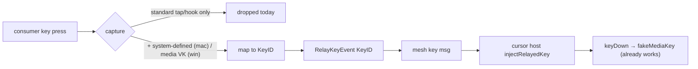

---
vgv_next:
  skill: build
  artifact: docs/plan/2026-07-04-feat-fleet-relay-media-consumer-keys-plan.md
title: relay media and consumer keys in fleet keyboard path
type: feat
date: 2026-07-04
---

## feat: relay media & consumer keys in the fleet keyboard path — Standard

## Overview

In mesh v2 auto mode, typing on the machine that physically owns the keyboard relays to whichever host holds the fleet cursor. Ordinary keys work; **consumer/media keys — volume, play/pause, next/prev, mute, brightness, eject — are silently dropped.** This plan closes that gap.

The fix is smaller than it first appears: Deskflow already has neutral `KeyID`s for these keys and a **working injection path on both platforms**. The only missing piece is **capture** — the mesh v2 relay monitors listen on the wrong OS event channel for consumer keys.

## Problem statement

| Observed | Expected |
|----------|----------|
| Pressing volume/brightness/media keys does nothing on the remote cursor host | They act on the cursor host, like ordinary keys |
| Only alphanumeric / navigation keys relay | Consumer-control keys relay too (where the target OS supports them) |

## Root cause

The client-epoch keyboard relay (mesh v2) uses its own minimal capture, separate from Deskflow's classic server key path, and it only taps **standard** key events:

- **macOS** — `src/lib/coordination/OSXKeyboardRelayMonitor.mm:94`
  Tap mask is `CGEventMaskBit(kCGEventKeyDown) | CGEventMaskBit(kCGEventKeyUp)`. Consumer keys arrive as `kCGEventSystemDefined` (`NX_SYSDEFINED`, `NSEvent` subtype 8) and are never in the mask. `mapRelayKeyFromCgEvent` (`KeyboardRelayMap.mm:104-111`) returns `false` for any non-KeyDown/Up type.
- **Windows** — `src/lib/coordination/KeyboardRelayMap.cpp:38-82`
  The `WH_KEYBOARD_LL` hook *does* see the media VKs (`VK_VOLUME_*`, `VK_MEDIA_*`, `VK_LAUNCH_*`), but `mapVirtualKey` has no cases for them, so they fall through to `ToUnicodeEx` → `kKeyNone` → dropped. (Brightness on Windows is firmware/consumer-HID and generally not visible to the keyboard hook — out of scope for Windows-origin capture.)

### Injection already works (no change needed)

- Neutral IDs exist: `kKeyAudioUp/Down/Mute/Play/Next/Prev/Stop`, `kKeyBrightnessUp/Down`, `kKeyEject` (`src/lib/deskflow/KeyTypes.h:279-292`).
- `RelayKeyEvent` already carries a `KeyID` — **no wire/protocol change**.
- **macOS inject:** `KeyState::fakeKeyDown` (`KeyState.cpp:816-823`) routes unmapped media IDs to `fakeMediaKey` → `OSXKeyState::fakeMediaKey` → `fakeNativeMediaKey` (`OSXMediaKeySupport.m:132`). Confirmed present.
- **Windows inject:** `MSWindowsKeyState` has the reverse table (`0x1af → kKeyAudioUp`, etc., `MSWindowsKeyState.cpp:459-463`), so media `KeyID`s map back to VKs for `keybd_event`/`SendInput`.



## Proposed solution

### Phase 1 — Windows capture (lowest risk, highest coverage)

**File:** `src/lib/coordination/KeyboardRelayMap.cpp`

Add media VK → `KeyID` cases in `mapVirtualKey` before the `ToUnicodeEx` fallback:

```cpp
// mapVirtualKey(): consumer-control keys the LL hook already delivers
case VK_VOLUME_MUTE:        return kKeyAudioMute;
case VK_VOLUME_DOWN:        return kKeyAudioDown;
case VK_VOLUME_UP:          return kKeyAudioUp;
case VK_MEDIA_NEXT_TRACK:   return kKeyAudioNext;
case VK_MEDIA_PREV_TRACK:   return kKeyAudioPrev;
case VK_MEDIA_STOP:         return kKeyAudioStop;
case VK_MEDIA_PLAY_PAUSE:   return kKeyAudioPlay;
```

These VKs are non-printable, so `mapRelayKeyFromHook`'s `id != kKeyNone` gate now forwards them. Down/up both flow (existing logic). No brightness on Windows-origin (not hook-visible) — documented.

### Phase 2 — macOS capture

**Files:** `src/lib/coordination/OSXKeyboardRelayMonitor.mm`, `KeyboardRelayMap.mm`, `KeyboardRelayMap.h`

1. Add `kCGEventSystemDefined` to the tap mask (`OSXKeyboardRelayMonitor.mm:94`) and to the callback's accepted types (`:65`).
2. In the callback, when `type == kCGEventSystemDefined`, decode the media key. Reuse the existing decoder rather than duplicating: expose a thin wrapper over `OSXMediaKeySupport`'s `isMediaKeyEvent` / `getMediaKeyEventInfo`, or add `mapRelayMediaKeyFromCgEvent(event, phase, id)` in `KeyboardRelayMap.mm`.
3. **Single-press semantics:** a system-defined media event encodes down *and* up in `data1`; the injector `fakeNativeMediaKey` **already posts both a down and an up**. To avoid double-actuation, forward exactly one relay event per physical press — emit a single `Down` (map the "up" system-defined event to a no-op, or forward only when `getMediaKeyEventInfo` reports `down == true`). The target's `fakeKeyDown` → `fakeMediaKey` then produces the complete down+up.

```objc
// OSXKeyboardRelayMonitor tapCallback (sketch)
if (type == kCGEventSystemDefined) {
  KeyID id = 0; bool down = false;
  if (!mapRelayMediaKeyFromCgEvent(event, /*out*/ id, /*out*/ down) || id == kKeyNone)
    return event;
  if (self->m_passThrough && self->m_passThrough()) return event; // cursor local
  if (down && self->m_send)
    self->m_send(Message::KeyPhase::Down, id, /*mask*/ 0, /*button*/ 0, {});
  return nullptr; // swallow so it does not also fire locally
}
```

### Phase 3 — Injection verification & Windows brightness best-effort

1. Add a focused test/manual check that `injectRelayedKey(kKeyAudioUp)` actuates on each target (macOS via `fakeMediaKey`; Windows via the media-VK table). No new code expected on macOS.
2. Confirm `MSWindowsKeyState` injects media `KeyID`s (walk `keyDown(kKeyAudioUp,…)` → VK → `keybd_event`/`SendInput`). If a gap exists, add the media-ID → VK inject mapping. Brightness inject on Windows: leave best-effort/unsupported (no standard API) and document.

### Phase 4 — Tests

**File:** `src/unittests/coordination/KeyboardRelayMapTests.*` (exists)

- Windows: `mapRelayKeyFromHook(VK_VOLUME_UP, …)` → `kKeyAudioUp`, phase Down; VK_VOLUME_MUTE/DOWN/MEDIA_* likewise; a printable key still resolves via ToUnicode (regression).
- macOS: extract the system-defined decode into a **pure** function (input: subtype, `data1`) so it is unit-testable without a live `NSEvent`; assert `NX_KEYTYPE_SOUND_UP → kKeyAudioUp`, brightness types map, and the "up" half yields no forwarded press (single-press rule).

## Files to change

| File | Change |
|------|--------|
| `src/lib/coordination/KeyboardRelayMap.cpp` | Add media VK cases to `mapVirtualKey` (Win capture) |
| `src/lib/coordination/OSXKeyboardRelayMonitor.mm` | Add `kCGEventSystemDefined` to mask + callback |
| `src/lib/coordination/KeyboardRelayMap.mm` | Add `mapRelayMediaKeyFromCgEvent` + pure decode helper |
| `src/lib/coordination/KeyboardRelayMap.h` | Declare the new mac helper |
| `src/lib/platform/MSWindowsKeyState.cpp` | Verify/add media `KeyID` → VK inject (only if gap found) |
| `src/unittests/coordination/KeyboardRelayMapTests.*` | VK→KeyID + NX-type→KeyID cases, single-press rule |

## Acceptance criteria

- [ ] From the keyboard-owning machine with cursor on a **remote** host: Volume Up/Down/Mute, Play/Pause, Next/Prev change **that host's** audio.
- [ ] macOS→macOS: Brightness Up/Down changes the remote Mac's brightness.
- [ ] Each media key fires **once** per press (no double-step from the down+up encoding).
- [ ] Cursor **local**: consumer keys act on the local machine exactly as before (no swallow, no double-fire).
- [ ] Ordinary keys unchanged (regression); rescue chord `Ctrl+Alt+Shift+Esc` still works.
- [ ] Windows-origin brightness documented as unsupported (hook cannot see it).
- [ ] `KeyboardRelayMapTests` cover Win VK→KeyID and mac NX-type→KeyID incl. single-press.

## Risks & mitigations

| Risk | Mitigation |
|------|------------|
| Double-actuation (system-defined down+up + injector's own down+up) | Forward a single Down per press; test asserts single fire |
| Swallowing system-defined events breaks local media keys when cursor is local | Gate on `passThrough()` exactly like standard keys; only swallow when forwarding |
| macOS TIS/main-queue assertions on the relay thread | Media decode needs no TIS/layout; avoid the `runOnMainQueue` layout path used for printable keys |
| Cross-platform key gaps (brightness on Windows, eject) | Scope to audio/media everywhere + brightness mac-only; document the rest |
| Repeat spam (holding volume) | Treat repeats as discrete Downs (matches native OS auto-repeat behavior) |

## Out of scope

- Windows-origin brightness capture (not exposed to the keyboard hook).
- New consumer usages beyond the existing `KeyID` set (e.g., launch keys) — additive later.
- Classic (mesh v1 / plain server) path — already handled by `OSXScreen::onMediaKey`; unchanged.

## Deployment

Same fleet flow as prior mesh v2 work: commit on `refactor/fleet-state-hub`, build + install on hackintosh / macbookpro (mac) and tiny11 (win) via the existing install scripts, then soak: audio keys cross-platform, brightness mac↔mac.
