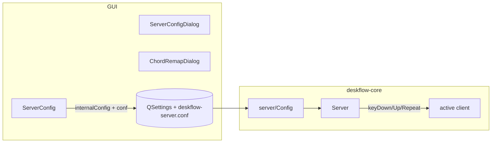

# feat: chord remap settings — Part 1 of 2

## Dependencies

**None** — merge first. Part 2 depends on this PR.

## Overview

Expose the server-side keyboard chord remap table in **Server Config** (per target screen, Hotkeys-style UI), persist via QSettings + `deskflow-server.conf`, and replace the hardcoded `kChordRemaps` in `Server.cpp` with config-driven remaps. **Fire-and-forget parity only** — Super+Tab → Alt+Tab behavior stays the same as today (quick switch, no switcher UI). Hold-through sessions ship in Part 2.

**Brainstorm:** [docs/brainstorm/2026-07-08-chord-remap-settings-and-hold-through-brainstorm-doc.md](../brainstorm/2026-07-08-chord-remap-settings-and-hold-through-brainstorm-doc.md)

## Problem Statement / Motivation

Chord remaps are hardcoded in `src/lib/server/Server.cpp` (`kChordRemaps`, gated on `tiny11`). Users cannot view or edit them without recompiling. PowerToys cannot remap KVM-injected input; remaps must stay server-side before relay.

## Proposed Solution

### Architecture



1. **GUI model** — `gui/ChordRemap` with `screen`, `inSequence`, `outSequence` (`KeySequence` × 2).
2. **Server model** — `deskflow::server::ChordRemapEntry` `{screen, inMods, inKey, outMods, outKey}` stored on `server::Config`.
3. **Dual persistence** — `internalConfig/chordRemaps` QSettings array + `section: chordRemaps` in generated conf.
4. **Server-side default seeding** — if section empty and screen `tiny11` exists, apply `kDefaultTiny11ChordRemaps` in `server::Config` (not GUI-only).
5. **Runtime** — `Server` queries `m_config` chord table filtered by `getName(m_active)` on each key event.

### Conf format

```text
section: chordRemaps
	tiny11:
		chordRemap(Super+Tab) = Alt+Tab
		chordRemap(Super+Q) = Alt+F4
end
```

Use `KeyMap::formatKey` / `KeySequence` string format (same family as `keystroke(...)`).

### QSettings row schema

```text
chordRemaps[i]/screen
chordRemaps[i]/inSequence/keys[j]/key    (via KeySequence::saveSettings in beginGroup("inSequence"))
chordRemaps[i]/outSequence/keys[j]/key   (via beginGroup("outSequence"))
```

### Server housekeeping (match Hotkeys)

- Clear `m_ChordRemaps` in `ServerConfig::setupScreens()` (like `hotkeys().clear()`).
- Include `m_ChordRemaps` in `ServerConfig::operator==`.
- Disable Chord Remaps tab in `toggleExternalConfig` by **widget name** (`tabChordRemaps`), not hardcoded index — today only tabs 0–1 are disabled; new tab must be included.

## Technical Considerations

### Files to touch

| Area | Files |
|------|-------|
| Remove hardcoded | `src/lib/server/Server.cpp` |
| Server types | `src/lib/server/ChordRemapTypes.h` (avoid name clash with `gui/ChordRemap.h`) |
| Conf | `src/lib/server/Config.{h,cpp}` |
| GUI model | `src/lib/gui/ChordRemap.{h,cpp}` |
| GUI config | `src/lib/gui/config/ServerConfig.{h,cpp}` |
| GUI dialogs | `ServerConfigDialog.{h,cpp,ui}`, `ChordRemapDialog.{h,cpp,ui}` |
| CMake | `src/lib/gui/CMakeLists.txt`, `src/lib/server/CMakeLists.txt`, `src/unittests/server/CMakeLists.txt` |
| Tests | `src/unittests/server/ChordRemapTests.cpp` |

**Do not add:** `ChordRemapTable` wrapper type, `Settings.h` changes (Hotkeys use raw `internalConfig` arrays), separate session files (Part 2).

### Precedents

- Hotkeys: `ServerConfig.cpp:95-136`, `186-191`; `HotkeyDialog`; `tabHotkeys`
- Conf parse: `Config::readSection` — add `chordRemaps` branch; **throw** on malformed lines (match existing `ServerConfigReadException` behavior)
- `needsHoldThrough()` — extract and unit-test in Part 1 but **unused** until Part 2 (~15 LOC prep)

### Out of scope (Part 1)

- Hold-through sessions / Alt+Tab switcher UI (Part 2)
- Per-row hold-through checkbox
- PowerToys import/export
- Live hot-reload without core restart

## Implementation Plan

### Phase 1 — Core types & matching

- [ ] Extract `ChordRemapEntry`, `applyChordRemap`, `needsHoldThrough`, `kDefaultTiny11ChordRemaps` into `src/lib/server/ChordRemapTypes.h` (header-only if possible).
- [ ] `ChordRemapTests`: exact match, CapsLock preservation, first-match precedence, `needsHoldThrough` truth table for all 11 seeded rows.

### Phase 2 — Persistence, conf, and runtime (merged)

- [ ] Add `ChordRemapList m_ChordRemaps` to GUI `ServerConfig`.
- [ ] `commit` / `recall`: `beginWriteArray("chordRemaps")` under `internalConfig`; GUI seeds defaults on empty recall for UX.
- [ ] `operator<<`: emit `section: chordRemaps` after `section: options`.
- [ ] `Config::readSectionChordRemaps`; store on `server::Config`; **server-side seed** if empty + `tiny11` screen exists.
- [ ] Include chord remaps in `Config::operator==` if equality is used in tests.
- [ ] Remove `kChordRemapTargetScreen` / static `kChordRemaps` from `Server.cpp`.
- [ ] `Server::applyChordRemapForActiveScreen(id, mask)` — lookup `m_config` by `getName(m_active)`.
- [ ] Keep calls in `onKeyDown`, `onKeyUp`, `onKeyRepeat`; verify `relayForwardedKey` path.
- [ ] **Conf round-trip test:** GUI `operator<<` → `Config::read` → assert 11 `tiny11` rows.

### Phase 3 — Server Config UI

- [ ] Add **Chord Remaps** tab adjacent to Hotkeys (index 2); `tabChordRemaps` object name.
- [ ] Screen `QComboBox` filters list; `QListWidget` + New/Edit/Remove.
- [ ] `ChordRemapDialog`: two `KeySequenceWidget` (in / out); list shows `Super+Tab → Alt+Tab`.
- [ ] Validation: reject duplicate in-chords per screen, empty sequences, in==out; list order = match precedence.
- [ ] Helper text: *"Applied only when the cursor is on the selected screen. Restart core after saving."*
- [ ] `toggleExternalConfig`: disable `tabChordRemaps` when external config enabled (match Hotkeys).

## Acceptance Criteria

### Settings

- [ ] Server Config → Chord Remaps shows 11 seeded rows for `tiny11` on upgrade (empty config).
- [ ] User can add, edit, remove rows per screen; duplicates blocked.
- [ ] Save persists to QSettings and `deskflow-server.conf`; survives kill-all restart.
- [ ] Rows for `tiny11` have **no effect** when cursor is not on `tiny11`.
- [ ] External config mode disables Chord Remaps tab (same as Hotkeys).

### Fire-and-forget parity (no regression vs hardcoded table)

- [ ] Win+Q→Alt+F4, Win+X→Ctrl+X, Win+W→Ctrl+W, etc. behave as today.
- [ ] Super+Tab → Alt+Tab still quick-switches (switcher UI fix is Part 2 — **not a regression**).

### Tests

- [ ] `ChordRemapTests`: matching, `needsHoldThrough` table, server-side default seeding.
- [ ] Conf round-trip test (GUI emit → `Config::read`).
- [ ] Existing server/coordination unit tests pass.

## Dependencies & Risks

| Risk | Mitigation |
|------|------------|
| Fleet upgrade with no conf section | Server-side `kDefaultTiny11ChordRemaps` seed in `Config` |
| Conf / Settings drift | Dual-write + round-trip test |
| Tab index drift | Disable by widget name, not index |

## References

- Parent overview: [2026-07-08-feat-chord-remap-settings-hold-through-plan.md](2026-07-08-feat-chord-remap-settings-hold-through-plan.md)
- Hardcoded remap: `src/lib/server/Server.cpp:48-98`, `1886-1948`
- Hotkeys: `src/lib/gui/config/ServerConfig.cpp:95-136`
- External config: `src/lib/gui/dialogs/ServerConfigDialog.cpp:368-372`

## Next

After merge: [Part 2 — hold-through sessions](2026-07-08-feat-chord-remap-settings-hold-through-part-2-plan.md)
