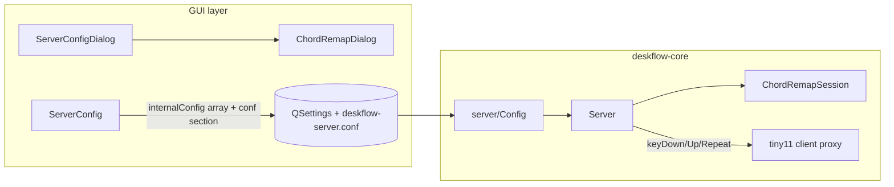

> **Note:** This plan has been split into parts after technical review. Build in order:
> 1. [Part 1 — settings + config-driven remaps](2026-07-08-feat-chord-remap-settings-hold-through-part-1-plan.md)
> 2. [Part 2 — hold-through sessions + fleet verification](2026-07-08-feat-chord-remap-settings-hold-through-part-2-plan.md)

# feat: chord remap settings and hold-through chords — Standard (overview)

## Overview

Expose Deskflow’s **server-side keyboard chord remap table** in **Server Config** (per target screen, Hotkeys-style UI), seeded with today’s 11-row PowerToys table for `tiny11`, and upgrade the runtime with **hold-through remap sessions** so chords like **Super+Tab → Alt+Tab** keep the output modifier held until the physical source modifier is released — enabling Windows’ Alt+Tab switcher UI and Tab-stepping.

**Brainstorm:** [docs/brainstorm/2026-07-08-chord-remap-settings-and-hold-through-brainstorm-doc.md](../brainstorm/2026-07-08-chord-remap-settings-and-hold-through-brainstorm-doc.md)

## Problem Statement / Motivation

Today, chord remaps are **hardcoded** in `src/lib/server/Server.cpp` (`kChordRemaps`, gated on `kChordRemapTargetScreen = "tiny11"`). Users cannot view or edit them without recompiling.

The remap engine rewrites `(KeyID, KeyModifierMask)` **per event**. That works for fire-and-forget shortcuts (Win+Q → Alt+F4) but breaks **hold-dependent** Windows UI: **Super+Tab → Alt+Tab** switches windows without showing the Alt+Tab switcher, because Windows only sees a brief Alt pulse around each Tab while Super stays physically held.

PowerToys cannot remap KVM-injected input; remaps must stay **server-side before relay** (documented in `Server.cpp` and `docs/plan/2026-07-07-feat-windows-virtual-hid-input-plan.md`).

## Proposed Solution

### Architecture (recommended approach A from brainstorm)



1. **Data model** — `ChordRemap` row: `targetScreen`, `inMods`, `inKey`, `outMods`, `outKey` (same semantics as today’s struct).
2. **Persistence** — Mirror Hotkeys: `internalConfig/chordRemaps` QSettings array **and** new `section: chordRemaps` in generated `deskflow-server.conf`, parsed by `server/Config.cpp`.
3. **GUI** — New **Chord Remaps** tab in `ServerConfigDialog`: screen filter combo + `QListWidget` + New/Edit/Remove; `ChordRemapDialog` with two `KeySequenceWidget` fields (in chord / out chord).
4. **Runtime** — Replace hardcoded table with config-loaded remaps filtered by `getName(m_active)`. Add `ChordRemapSession` on `Server` for implicit hold-through.
5. **Session teardown** — Cancel session and release held output modifiers on `jumpToScreen`, `switchScreen` (leaving target), keyboard rescue, and client disconnect.

### Hold-through session (implicit rule)

**Trigger:** Remap matches on key down **and** `needsHoldThrough(entry)`:

```cpp
// ChordRemap.h — pseudo
bool needsHoldThrough(const ChordRemap &e) {
  const auto chord = KeyModifierShift | KeyModifierControl | KeyModifierAlt | KeyModifierSuper;
  const auto in = e.inMods & chord;
  const auto out = e.outMods & chord;
  // Same trigger key, output chord modifier set differs from input → hold output until source chord mod up
  return e.inKey == e.outKey && out != in && out != 0;
}
```

**Truth table for seeded rows:**

| In chord | Out chord | Hold-through? | Notes |
|----------|-----------|---------------|-------|
| Super+Tab | Alt+Tab | **Yes** | Primary fix — Alt held until Super up |
| Super+H | Super+Down | No | Output still Super family |
| Super+Q | Alt+F4 | No | Fire-and-forget close |
| Super+N/R/T/V/W/X/` | Ctrl+* | No | Fire-and-forget |
| Ctrl+Alt+F12 | Win+Tab | **Maybe** | If Task View needs held Win, add per-row flag in follow-up; v1 uses implicit rule (Win held until Ctrl+Alt up) |

**Session lifecycle:**

```text
Super down (no session yet)
Super+Tab down → match remap → start session
  → inject output modifier DOWN once (prefer kKeySetModifiers on active client, see InputFilter precedent)
  → relay Tab with effective mask including held output modifier
Super+Tab repeat → stay in session; do NOT pulse output modifier
Super up → end session → inject output modifier UP (kKeyClearModifiers)
Tab up → normal key release
```

Track **source modifier release by `KeyButton`** (not mask bit alone) so L-Super vs R-Super is correct; session ends only when the button that started the chord modifier releases.

### Conf format (new section)

```text
section: chordRemaps
	tiny11:
		chordRemap(Super+Tab) = Alt+Tab
		chordRemap(Super+Q) = Alt+F4
		...
end
```

Use `KeyMap::formatKey` / existing `KeySequence` string format for consistency with hotkey `keystroke(...)` lines.

## Technical Considerations

### Files to touch (primary)

| Area | Files |
|------|-------|
| **Hardcoded remap (remove)** | `src/lib/server/Server.cpp` |
| **New server types** | `src/lib/server/ChordRemap.h`, `ChordRemapSession.h`, `ChordRemapSession.cpp` (or `.h` only if small) |
| **Conf parse/write** | `src/lib/server/Config.cpp`, `Config.h` |
| **GUI model** | `src/lib/gui/ChordRemap.h`, `ChordRemap.cpp` |
| **GUI config** | `src/lib/gui/config/ServerConfig.h`, `ServerConfig.cpp` |
| **GUI dialogs** | `src/lib/gui/dialogs/ServerConfigDialog.{h,cpp,ui}`, new `ChordRemapDialog.{h,cpp,ui}` |
| **Settings keys** | `src/lib/common/Settings.h` (`m_validKeys` if needed) |
| **CMake** | `src/lib/gui/CMakeLists.txt`, `src/lib/server/CMakeLists.txt` |
| **Tests** | `src/unittests/server/ChordRemapTests.cpp`, `ChordRemapSessionTests.cpp` |

### Precedents to follow

- **Hotkeys list UI:** `ServerConfigDialog` tabHotkeys, `HotkeyDialog`, `Hotkey::saveSettings` / `loadSettings`
- **Conf generation:** `operator<<(QTextStream &, const ServerConfig &)` in `ServerConfig.cpp`
- **Conf parsing:** `Config::readSection` in `Config.cpp` — add `chordRemaps` branch
- **Modifier inject:** `InputFilter::MouseButtonAction::perform` uses `kKeySetModifiers` / `kKeyClearModifiers` (`src/lib/server/InputFilter.cpp:535`)
- **Modifier synthesis constraint:** `KeyMap::keysToRestoreModifiers` (`src/lib/deskflow/KeyMap.cpp`) — session must avoid per-Tab mask fighting

### Architecture impacts

- Remaps remain **server-only**; clients unchanged except receiving better modifier sequences.
- `relayForwardedKey` already funnels into `onKeyDown`/`onKeyUp` — fleet keyboard relay gets remaps automatically when `tiny11` is active.
- **Restart required** after Save (same as hotkeys / server conf today). Label in UI: *"Restart Deskflow core to apply chord remap changes."*

### Performance / security

- Negligible: small table per screen, O(n) match (n ≈ 11).
- No new network surface; conf is local. Validate parsed rows; skip malformed lines with log warning.

### Out of scope (YAGNI)

- PowerToys JSON import/export
- Global (non per-screen) remaps
- Per-row hold-through checkbox (unless Ctrl+Alt+F12→Win+Tab fails implicit rule in manual test)
- Client-side remaps on non-server machines
- Live hot-reload without core restart

## Implementation Plan

### Phase 1 — Core types & matching (no GUI)

- [ ] Extract `ChordRemap`, `ChordRemapTable`, `applyChordRemap`, `needsHoldThrough` from `Server.cpp` into `src/lib/server/ChordRemap.h` (+ `.cpp` if needed).
- [ ] Add `kDefaultTiny11ChordRemaps` (move current 11 entries from `Server.cpp`).
- [ ] Unit tests: exact chord match, modifier bit preservation (CapsLock), first-match precedence, `needsHoldThrough` truth table.

### Phase 2 — Config persistence

- [ ] Add `ChordRemapList` to GUI `ServerConfig` (`m_ChordRemaps`).
- [ ] `ServerConfig::commit` / `recall`: `beginWriteArray("chordRemaps")` under `internalConfig` (fields: `screen`, `inSequence`, `outSequence` via `KeySequence`).
- [ ] **Migration:** on `recall`, if array empty **and** screen `tiny11` exists → seed `kDefaultTiny11ChordRemaps`; never overwrite non-empty user data.
- [ ] Extend `operator<<` to emit `section: chordRemaps`.
- [ ] Add `Config::readSectionChordRemaps` + storage on `server::Config`; wire into `readSection`.
- [ ] Pass parsed table into `Server` at construction (`ServerApp::openServer`).

### Phase 3 — Server Config UI

- [ ] Add **Chord Remaps** tab to `ServerConfigDialog.ui` (mirror Hotkeys: list + New/Edit/Remove).
- [ ] Screen `QComboBox` at top — filters list to remaps for selected screen.
- [ ] `ChordRemapDialog`: `KeySequenceWidget` for in-chord and out-chord; read-only summary in list rows (`Super+Tab → Alt+Tab`).
- [ ] Validation on Save: reject duplicate in-chords per screen, empty sequences, in==out.
- [ ] Helper text: *"Applied only when the cursor is on the selected screen. Restart core after saving."*

### Phase 4 — Config-driven remap (fire-and-forget parity)

- [ ] Remove `kChordRemapTargetScreen` / static `kChordRemaps` from `Server.cpp`.
- [ ] `Server::applyChordRemapForActiveScreen(id, mask)` — lookup `getName(m_active)` in config table.
- [ ] Keep calls in `onKeyDown`, `onKeyUp`, `onKeyRepeat` (and verify `relayForwardedKey` path).
- [ ] Regression: all 10 fire-and-forget seeded rows behave as before hardcoded table.

### Phase 5 — Hold-through sessions

- [ ] Add `ChordRemapSession m_chordRemapSession` to `Server`.
- [ ] `startSession(entry, sourceButton)`, `stepSession(...)`, `endSession(reason)` — `endSession` sends `kKeyClearModifiers` for held output mods via active client.
- [ ] `onKeyDown`: if session active, OR held output modifier into effective mask for non-modifier keys; skip re-starting session.
- [ ] Detect source modifier `keyUp` by `KeyButton` → `endSession`.
- [ ] `onKeyRepeat`: maintain session; no modifier pulse.
- [ ] **Teardown hooks:** call `cancelChordRemapSession()` from `jumpToScreen`, `switchScreen` (when leaving previous active), keyboard rescue block in `onKeyDown`, and client disconnect handler if modifiers could stick.
- [ ] Unit tests: session start → Tab repeat → Super up → Alt released; screen jump mid-session; rescue mid-session.

### Phase 6 — Fleet verification

- [ ] Manual matrix on fleet (hackintosh server, tiny11 target):
  - Local Cmd+Tab with cursor on tiny11 → switcher UI visible
  - MacBook keyboard relay + cursor on tiny11 → same behavior
  - Win+Q, Win+X, etc. unchanged
  - Edge cross mid-Cmd-hold → no stuck Alt on tiny11
- [ ] Deploy via `scripts/fleet-deploy.sh --deskflow-only` (full kill-everything restart per fleet rule).

## Acceptance Criteria

### Settings

- [ ] Server Config → Chord Remaps tab shows 11 seeded rows for `tiny11` on upgrade (empty config).
- [ ] User can add, edit, remove rows per screen; duplicates blocked.
- [ ] Save persists to QSettings **and** `deskflow-server.conf`; survives kill-all restart.
- [ ] Rows for `tiny11` have **no effect** when cursor is not on `tiny11`.

### Hold-through

- [ ] **Super+Tab** (Mac Cmd+Tab) with cursor on `tiny11` shows **Windows Alt+Tab switcher UI**.
- [ ] Holding Super and pressing Tab repeatedly steps through windows with switcher visible.
- [ ] Releasing Super dismisses switcher (Alt up); no stuck modifiers.
- [ ] **Fleet relay parity:** same behavior when typing on MacBook with cursor on `tiny11`.

### Regression

- [ ] Fire-and-forget remaps (Win+Q→Alt+F4, Win+X→Ctrl+X, etc.) work as today.
- [ ] Keyboard rescue (Ctrl+Alt+Shift+Esc) still yanks cursor; ends active hold session; no stuck Alt on tiny11.
- [ ] Screen change during active hold releases output modifiers on target.
- [ ] CapsLock and other non-chord modifier bits preserved through remap and session.

### Tests

- [ ] `ChordRemapTests`: matching, migration defaults, `needsHoldThrough` table.
- [ ] `ChordRemapSessionTests`: lifecycle, teardown on screen jump / rescue.
- [ ] Existing coordination/server unit tests still pass.

## Success Metrics

- User can change Win+Tab→Alt+Tab mapping in GUI without editing C++ or recompiling.
- Alt+Tab switcher UI works from Mac keyboard on `tiny11` (primary acceptance test).
- Zero reports of stuck Alt/Win after edge-cross or rescue during testing week.

## Dependencies & Risks

| Risk | Mitigation |
|------|------------|
| `KeyMap` pulses modifiers per event | Session uses explicit set/clear + stable effective mask |
| Ctrl+Alt+F12→Win+Tab implicit hold wrong | Document in UI; add per-row flag in follow-up if Task View fails |
| Conf / Settings drift | Dual-write like hotkeys; round-trip test |
| External config mode | If `useExternalConfig`, chord remaps from GUI may be ignored — disable tab or show warning (match hotkeys behavior) |
| Large PR | Optional split: **PR1** settings + config-driven fire-and-forget; **PR2** hold-through sessions |

## References & Research

- Brainstorm: `docs/brainstorm/2026-07-08-chord-remap-settings-and-hold-through-brainstorm-doc.md`
- Hardcoded remap: `src/lib/server/Server.cpp:48-98`, `1886-1948`
- Hotkeys persistence: `src/lib/gui/config/ServerConfig.cpp:95-136`, `186-191`
- Conf sections: `src/lib/server/Config.cpp:410-451`
- Modifier set/clear: `src/lib/server/InputFilter.cpp:535`, `src/lib/deskflow/KeyTypes.h:262-263`
- KeyMap modifier restore: `src/lib/deskflow/KeyMap.cpp:542`, `766`
- Prior remap rationale: `docs/plan/2026-07-07-feat-windows-virtual-hid-input-plan.md`
- User-flow analysis: session teardown, fleet relay parity, validation gaps (incorporated above)

## Suggested PR split (optional)

| PR | Scope |
|----|-------|
| **PR1** | Phases 1–4: model, conf, GUI, config-driven remap (fire-and-forget parity) |
| **PR2** | Phase 5–6: `ChordRemapSession`, Alt+Tab switcher, fleet manual verification |

PR1 is independently shippable (settings visibility + editable table); PR2 delivers the switcher fix.
